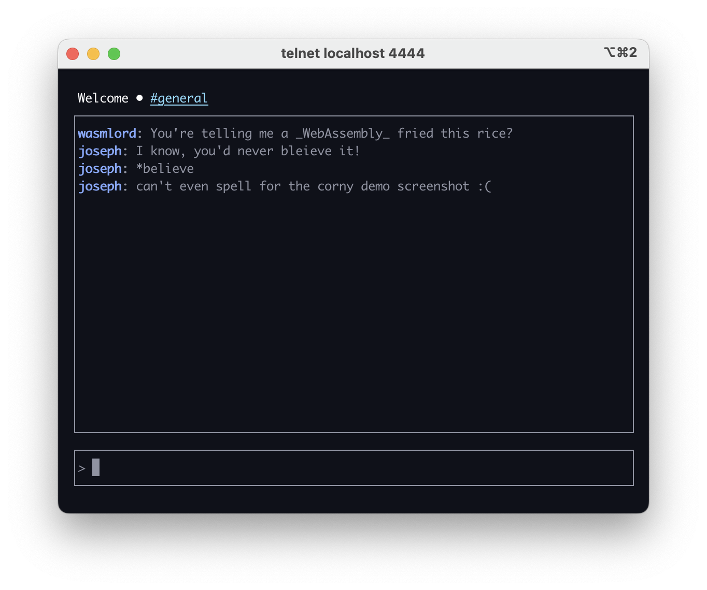

# A telnet chat server, built with Grain & Lunatic!

This is a port of https://github.com/lunatic-solutions/chat, with src/termite being a port of https://crates.io/crates/termion and src/tui being a port of https://crates.io/crates/tui (both of which will be spun out into their own standalone libraries)!

Using Lunatic processes, telnet commands are converted from raw bytes to nice data types, which are then processed and user to render the UI.

## Building and running

You'll need Grain v0.6, which you can obtain [from the Grain website](https://grain-lang.org/docs/getting_grain) or by [building Grain from source](https://grain-lang.org/docs/getting_grain#Building-Grain-from-Source).

In a directory next to the directory where you've cloned this chat, clone https://github.com/grain-lang/lunatic-gr.

Once that's all set, you can run `make` to build `chat.wasm`.

To run the server, you'll need [Lunatic](https://lunatic.solutions/) v0.12—with Lunatic installed, run `lunatic chat.wasm <port>`.

To connect to the server, you'll need a telnet client. There may already be a telnet client on your machine, but if not, on macOS you can install one with `brew install telnet`. Run `telnet localhost <port>` to connect!
